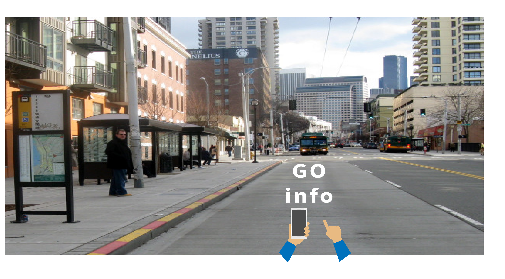

GoInfo is a volunteerism game for crowdsourcing pedestrian and accessibility information, and is a fork/adaptation of the [StreetComplete](https://github.com/westnordost/StreetComplete) project.

A pre-release alpha is available here: https://github.com/OpenSidewalks/GoInfoGame/releases/download/v0.1a1/GoInfo.prerelease.a1.apk
[Warning: NOT compatible with StreetComplete. You must uninstall StreetComplete to safely install the apk]

Players see an overhead map view, with easy to tap icons representing 'quests'. Quests are simple surveys for missing labels in [OpenStreetMap](https://www.openstreemap.org); for example, a given quest may ask the player to say whether the sidewalk they are using is made of concrete, or asphalt, or another material. Answer are submitted directly to OpenStreetMap, and the player receives feedback and individual recognition for their contributions - everything is submitted under their OpenStreetMap account.

Where GoInfo differs from StreetComplete:

- GoInfo is focused on mapping pedestrian and accessibility information, and has customized quests that tie into the [AccessMap](https://www.accessmap.io) and [Opensidewalks](https://www.opensidewalks.com) projects.
- GoInfo can more easily handle multiple quests for a single feature, such as several questions in a row about a bus stop
- GoInfo provides more feedback while questions are being answered, and seeks to add more gamification and rewards to return users that add high-quality information.

## Screenshots
    

## Authors

GoInfo was initially adapted from the [StreetComplete](https://github.com/westnordost/StreetComplete) project as part of the "A City For All" hackathon hosted in Seattle, WA on Sept 24, 2017. We would first like to give thanks both to the development team of StreetComplete for building such a powerful, adaptable, and open source platform, and the task force that organized the hackathon. 

The team/mentors are listed in reverse alphabetical order.

#### Core Team

- Manisha Vyas
- Jonathan Que
- Drew Stone
- Neelam Purswani
- Samantha Gallagher
- Suresh Devalapalli

#### Mentors

- Anat Caspi
- Nick Bolten

## License

This software is released under the terms of the [GNU General Public License](http://www.gnu.org/licenses/gpl-3.0.html).
